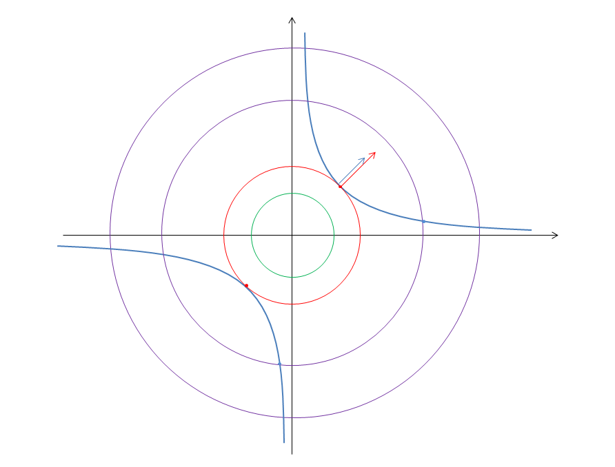

数据和特征决定了机器学习的上限,而模型和算法只是逼近这个上限而已！
回顾及沉淀一下特征处理相关的知识和基础

<!-- more -->

# 特征处理之背景知识

在机器学习过程中有一个特别重要的环节那就是**特征工程**(Feature Engineering)。特征工程 得到的特征决定了一个机器学习任务的最终**上限**。试想一个上限不高的机器学习任务，再厉害的算法策略又能怎样，又再思考下上限非常高的机器学习就算再朴素的模型不断调参尝试总能不断获得进步(有很高的上升空间)。因此在做机器学习任务的时候可能大部分时间要需要投入到特征工程中，可见特征工程的重要性。

> 特征工程（Feature Engineering）泛指从原始数据转换为特征向量的过程。其中包含三大模块: 特征处理，特征选择，特征降维。

本篇主要回顾下特征工程中最核心的特征处理

先再最前面预留一些问题，如果这些问题都能回答上来那么本篇文章基本也就不用看了省点时间多睡觉
1. 什么是特征
2. 为什么要进行特征处理
3. 特征处理在机器学习过程中处于哪个位置
4. 特征处理与特征工程是什么关系
5. 特征有哪些类型
6. 要如何进行特征处理(在其他"特征处理"文章中细讲)

> 以下我自己对这些问题的理解，不对请务必要喷，被喷使我成长 o(￣▽￣)ｄ

## 什么是特征
在机器学习任务中，描述/表达一件事物的属性数据/抽象结果称为特征。

记得初学的时候，觉得收集的数据不就是特征么。其实这个理解不能说不对，但太浅显，特征是直接作用于我们最终分类(聚类回归等)任务的，为了更好地服务最终任务，特征承载了更多的意义，它需要为了帮助机器的最终任务更好地去描述和表达一件事物。

稍微通俗一点，假设收集了NBA球员的身高数据准备做一些有趣的事情，那么身高数据本身就是一个原始特征，但因为数据连续样本不够等等原因难以很好的利用起来。那么如果将身高数据换算成适当的身高区间数据呢？是不是就能够更好的完成那件有趣的事情了。

## 为什么要进行特征处理
当前数据/特征表达能力不够好或者不能达到模型要求，因此要进行处理。

比如拿到的是图片或者多媒体数据，如果不将原始数据处理成更具有表达性的特征数据直接处理那些原始数据会造成一系列问题，比如算力不够特征稀疏等等。再比如为了提升迭代速度，或者评判特征之间的重要性等也需要对数据进行特征处理。

上述例子收集了NBA的身高数据准备做一些有趣的事情。上面说的将身高换算成适当的身高区间就是一种特征的处理，使得区间内部的身高数据都不会造成不同的影响，但区间与区间之间却有着完全不同的表现，将身高特征的表达能力变得更好更合理了。
另外如果发现收集到的数据有一些NBA人员的身高缺失了？有一些人员的数据是异常的？备选的训练模型还不接受缺失值？也是需要特征处理来解决问题。

## 特征处理在机器学习中处于哪个位置
