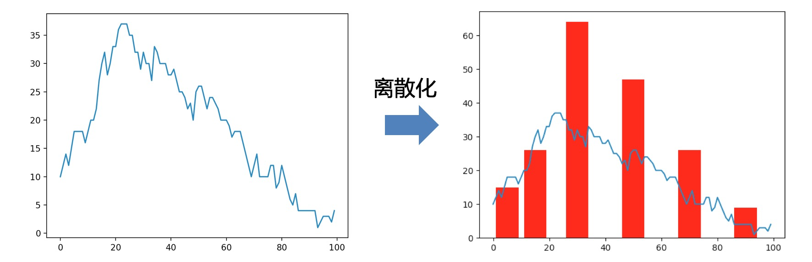
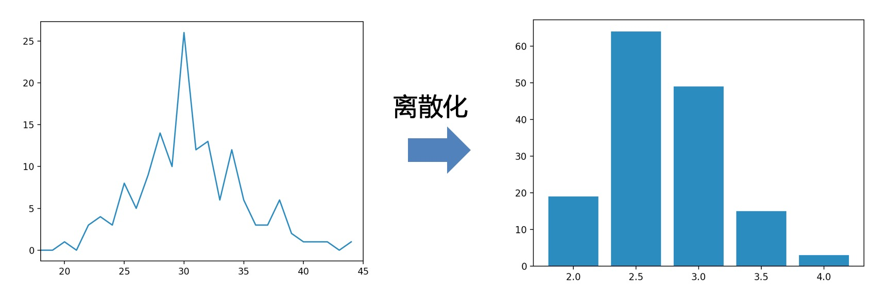
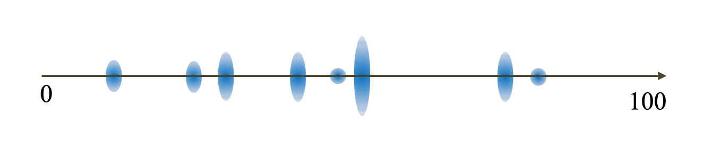
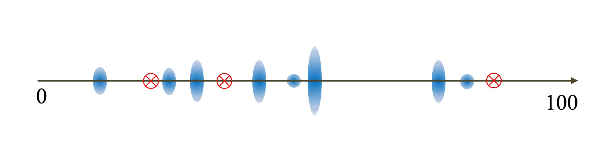
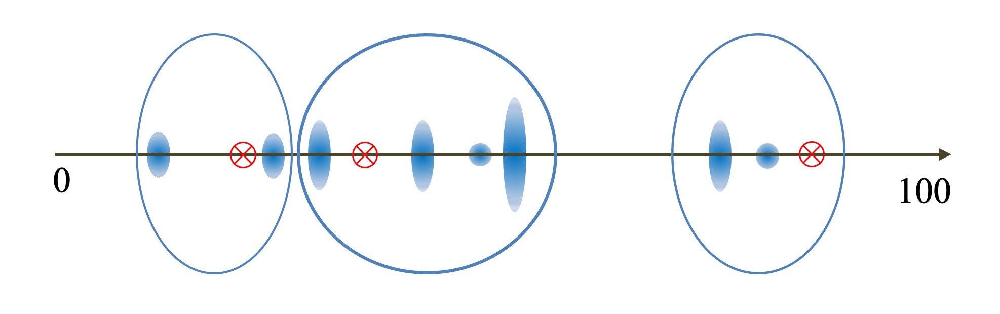
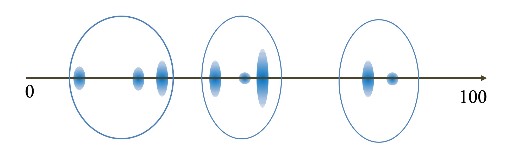

数据和特征决定了机器学习的<font color="#dd00dd">上限</font>，而模型和算法只是<font color="#dd00dd">逼近</font>这个上限而已！
无量纲化能提升特征可比性，优化训练时间；哑编码能降低模型复杂度，提升特征表达能力，提升运算时间，提升非线性能力。

<!-- more -->


# 特征处理之离散化

## 一、什么是离散化

将连续型的特征进行离散处理，得到有限的离散值。

如图：



另外再借用哑编码的图片：




## 二、离散化有什么作用

1. <font color="crimson">简化了模型训练的复杂性，降低模型过拟合的风险（离散化带来的优势）</font>

2. <font color="crimson">离散化后的特征对异常数据有很强的鲁棒性（离散化带来的优势）</font>

3. <font color="deepskyblue">稀疏向量内积乘法运算速度快，因为稀疏矩阵有实数的值很少，做内积运算时就会有很多优化手段</font>

4. <font color="deepskyblue">线性模型表达能力受限，单变量离散化为N个后，每个变量有单独的权重，相当于为模型引入了非线性，能够提升模型表达能力，加大拟合能力；</font>

5. <font color="deepskyblue">离散化后可以进行特征交叉，由M+N个变量变为M*N个变量，进一步引入非线性，提升表达能力</font>


红色部分是离散化带来的作用或者说优点，蓝色部分是离散化后的哑编码带来的作用和优点。


## 三、 如何离散化（无监督）

假设有一串连续的数值，我们需要对其进行离散化：以下都会使用这份数据作为例子。

```
例子: 1    3    4    5    5    6    7    7    8    10    11    13    15
```


### 3.1 等距/等频离散

#### （1）等距离散

用相等的距离作为范围，使得在同一范围内的数值，被认定为同一类别。

假设距离为5，那么就有`A:(0,5],B:(5,10],C:(10,15]`三个离散范围

于是，我们将上面的例子进行离散:

等距离散:

```
范围选择 A:[1 3 4 5 5], B:[6 7 7 8 10], C:[11 13 15]
例子: 1    3    4    5    5    6    7    7    8    10    11    13    15
离散: A    A    A    A    A    B    B    B    B    B     C     C     C
```


#### （2）等频离散

用相等选择频度作为范围，使得在同一频度内的数值，被认定为同一类别。

假设距离为3，

于是，我们将上面的例子进行离散:

等距离散:

```
步频选择 A:[1 3 4], B:[5 5 6], C:[7 7 8], D:[10 11 13], E:[15]
例子: 1    3    4    5    5    6    7    7    8    10    11    13    15 
离散: A    A    A    B    B    B    C    C    C    D     D     D     E
```


### 3.2 KMeans离散

借助于KMeans聚类的思路，将数值进行聚类，最终聚为一类的则被认定为同一类别。

这里不太好举例子，咱们用数轴来表述，数轴上蓝色蛋蛋更大意味着数据在这里的数据越多。



然后咱们开始，K=3的聚类，首先随机散落三个点作为中心点



所有的数值，选择离散落的三个点最近的点作为第一次聚类结果



以聚类结果的中心，作为新的三个中心点，重新重复上述过程。

最终会收敛聚类结果不再变化。




## 四、如何离散化（有监督）

有监督的离散化，主要利用了已有的类别标注来将特征进行更好地离散。为了表达方便，将上面使用的例子标注一行类目。

```
例子: 1    3    4    5    5    6    7    7    8    10    11    13   
离散: C1   C1   C2   C1   C1   C2   C1   C1   C2   C2    C1    C2    
```


### 4.1 基于信息增益的离散


### 4.2 基于Gini增益的离散 


# 结语

<font color="red">特征处理</font>是在机器学习中占据非常重要的地位，特征工程决定了整个模型的上限，而特征工程中最基础的就是<font color="red">特征处理</font>。本篇主要回顾下特征处理中的离散化。最后最后拿出成果：

1. 什么是离散化
2. 离散化有什么作用
3. 如何进行无监督离散
4. 如何进行有监督离散


# 附录

[特征处理PPT](./45aaf959/特征处理PPT.pptx)