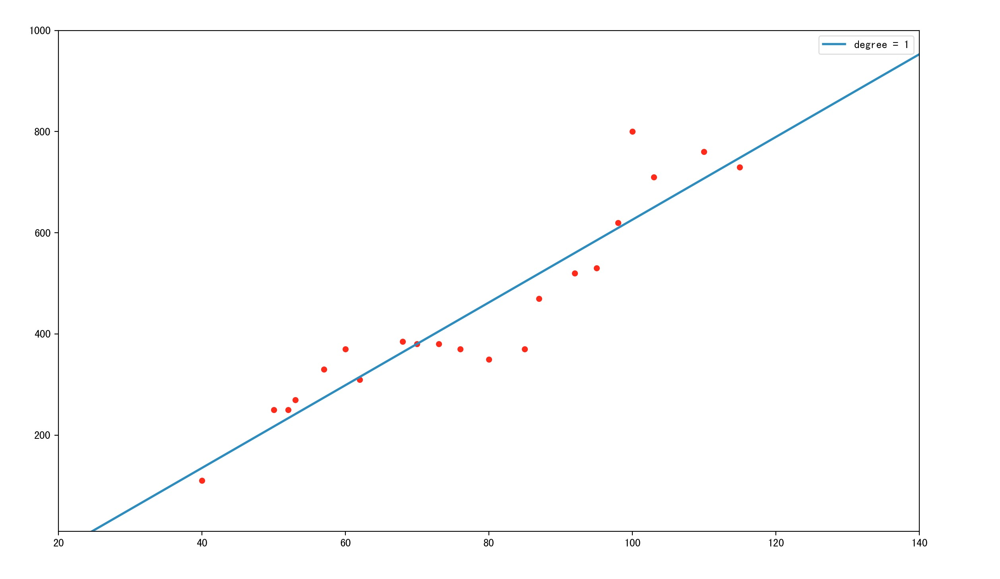

在工作中，经常遇到很多事情会涉及到算法机器学习，然而似乎有不少人会对算法亦或是机器学习有着这样那样的误解。于是我准备收拾一下，机器学习的基础知识，以辅助大家了解机器学习，知道机器学习是干什么的，它又是怎么工作的。

<!-- more -->


# 机器学习扫盲
## 什么是机器学习
机器学习是人工智能的一种实现方式，机器学习算法是一类从数据中自动分析获得规律，并利用规律对未知数据进行预测的算法。它致力于研究如何通过计算的手段，利用已知的经验来改善系统自身，从而应对新的情况时能够提供相应的判断。

简而言之，机器学习研究的是计算机怎样模拟人类的智力行为或者推测逻辑，以使得计算机获取新的知识或技能，并通过学习不断改善自身。计算机本身不具备推理能力，只有人类设计好告诉它如何学习，它才能去学习总结，了解因果关系才具备了推理能力。

举个简单的例子: 
人类是如何买西瓜的？水果店老板总是会说西瓜保甜不甜不要钱。但是人类还是得费尽心思去挑最甜的西瓜，因为人类知道水果店肯定有不甜的西瓜。

```
1. 人类会随便买一个，或者让店老板挑一个，然后回去尝一下，发现不甜
2. 又去了那家店，自己再挑了一个，然后回去尝了一下，发现还是不甜
3. 结果发现，两次挑的瓜瓜柄都比较畸形，是不是瓜柄畸形的都不甜? **（推理）**
4. 于是再去买西瓜，挑一个瓜柄比较匀称的，然后回去一尝，甜的
5. 再买了两个瓜柄比较匀称的，发现都比较甜，发现瓜柄比较匀称确实要甜 **（学习）**
6. 但是再买几次，发现瓜柄比较匀称的，也有几率会不甜
7. 于是发现，瓜柄比较匀称的瓜，如果纹路不清晰，也会不甜
8. 最后人类每次去买瓜都是买瓜柄比较匀称，纹路清晰的瓜，于是绝大情况下都是甜的
```


那么计算机是如何学习呢，其实过程是一样的，它也需要通过不断的观察学习才能总结出一套模型来应对没见过的新事物。只不过计算机比较笨推理能力比人类差得多，它需要人类预先告知它要观察什么，如何观察，如何调整自己(反思)，如何学习总结。它还需要比人类需要更多的样本和学习的次数，来学习出其中因果关系。

``` 
1. 先买1000个西瓜，全部劈开，先尝好甜还是不甜
2. 记录所有西瓜的瓜柄和纹理，还有其他觉得可能会对甜度有影响的信息
3. 计算机模拟上述人类的思考过程几百次几千次
4. 然后总结出一套理论，瓜柄比较匀称，纹路清晰的瓜，是甜的
5. 再买20个瓜，验证下
``` 


近年来互联网数据大爆炸，数据无论在丰富度和覆盖面还有复杂度上都远远超出人工可以观察和总结的范畴，而机器学习的算法能在海量数据中，挖掘出有用的价值，观察和总结核心的信息，给我们带来了前所未有的思考方式。


## 机器学习关注哪些事情
### 1.回归问题
回归(Regression)是拟合两个或者多个变量之间的关系，比如回归出房屋面积变量与房价变量之间的函数关系。回归问题通常用来预测一个未知“值”，一般情况下是这个值是连续值，比如预测房价、未来销量等等，回归是对真实值的一种逼近预测。

举个简单的例子
这里有一份某城市的房价数据如下(横轴为房屋面积，纵轴为房价):


如果我们使用一根直线来拟合，那么会是这个样子


那么该函数就是对这些房价数据进行的一次回归。此时就可以预测任何面积下的房价了。
但是，有网友就会有疑问了，这直线拟合这么差，预测都不准的。
所以我们才需要更好的回归模型，更多的特征变量(上述只有房屋面积这一个特征)，才能做出更好的拟合，才能更准的预测出房屋的价格。

另外，这里插一段“过拟合”的描述。如下图。
其中蓝色直线为线性拟合，拟合程度肉眼可见的不够，很多点都离的比较远，像这种情况我们称为<font color=red>“欠拟合”</font>
其中橙色曲线为5阶拟合，感觉拟合不错，而且曲线也较简单
其中绿色直线为15阶拟合，拟合程度相当给力几乎大部分点都在线上，但是！该曲线太过复杂，假设有测试集的话一定在测试集中表现相当不好。像这种情况我们称为<font color=red>“过拟合”</font>

无论是过拟合还是欠拟合，都不是我们希望发生的，都需要尽量避免的情况。


### 2.分类问题
分类(classification)任务

### 3.聚类问题

### 4.异常监测

### 5.数据降维

## 机器学习基本流程

## 机器学习的应用领域

## 其他疑问

### 那么机器学习算法与算法导论的算法有什么区别？
有时候会有人疑问，机器学习算法与我们平时接触的排序算法，最短路径，动态规划算法有些什么不同？
实际，他们本质上都是解决问题的一系列步骤。从这点出发他们都是一致的。
算法导论里的算法本质上是对有精确解的问题，如何更有效率地求得这个解。这个效率可以是计算时间更短，也可以是计算过程所需要的空间更少。
机器学习要解决的问题一般没有精确解，也不能用穷举或遍历这种步骤明确的方法找到解，而且需要强调的是“学习”这个属性，即希望算法本身能够根据给定的数据或计算环境的改变而动态的发现新的规律，甚至改变算法程序的逻辑和行为。
机器学习里面大部分想要解决的问题是NP困难的 (比方说最宽泛的优化问题）。这类问题一般会考虑用迭代求解的办法尝试寻找一个近似解。又或者有时候直接求解一个问题的复杂度会是O(n^3)但是迭代的话现实中会比理论的更快收敛(e.g. matrix inversion by conjugate gradients vs. by direct inversion)，算法导论里面的问题比如排序或者字符串处理并不在这一类NP困难的问题内, 因此迭代的方法可能不那么常见。
因此，经典算法是在解决问题，然而学习算法中有些环节并不是在解决问题，而是在猜测问题，有了对问题的猜测，才开始解决问题，不同的学习算法就包含了不同的猜问题的策略，也就是归纳偏执（inductive bias）。这一部分就是经典算法中所没有的部分，是机器学习研究的核心。
