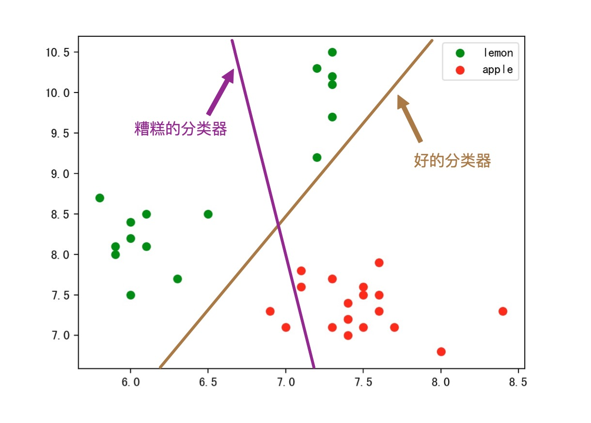

在工作中，经常遇到很多事情会涉及到算法机器学习，然而似乎有不少人会对算法亦或是机器学习有着这样那样的误解。于是我准备收拾一下，机器学习的基础知识，以辅助大家了解机器学习，知道机器学习是干什么的，它又是怎么工作的。🤗

<!-- more -->

# 机器学习扫盲
## 什么是机器学习
机器学习是人工智能的一种实现方式，机器学习算法是一类从数据中自动分析获得规律，并利用规律对未知数据进行预测的算法。它致力于研究如何通过计算的手段，利用已知的经验来改善系统自身，从而应对新的情况时能够提供相应的判断。

简而言之，机器学习研究的是计算机怎样模拟人类的智力行为或者推测逻辑，以使得计算机获取新的知识或技能，并通过学习不断改善自身。计算机本身不具备推理能力，只有人类设计好告诉它如何学习，它才能去学习总结，了解因果关系才具备了推理能力。

举个简单的例子: 
人类是如何买西瓜的？水果店老板总是会说西瓜保甜不甜不要钱🤥。但是人类还是得费尽心思去挑甜的西瓜，因为聪明的人类知道水果店肯定有不甜的西瓜。那么接下来就是人类学习的过程:

```
1. 人类会先随便买一个🍉，或者让店老板挑一个，然后回去尝一下，发现不甜*(采样)*
2. 又去了那家店，自己一本正经再挑了一个🍉，然后又回去尝了一下发现居然是甜的!*(采样)*
3. 结果发现，甜的瓜柄比较匀称，不甜的瓜柄比较畸形，是不是瓜柄畸形的都不甜? *(推理/学习)*
4. 于是再去买瓜，假装自己是高手挑了一个瓜柄比较匀称的，然后回去一尝哇甜的!*(验证)*
5. 再买了两个瓜，当然柄比较匀称的，然后!居然!不甜!*(验证)*
6. 于是经过仔细发现，瓜柄比较匀称的瓜，如果纹路不清晰，也会不甜*(调特征/再学习)*
7. 最后人类每次去买瓜都是买瓜柄比较匀称，纹路清晰的瓜，于是绝大情况下都是甜的*(上线)*
```


那么计算机是如何学习呢，其实过程是一样的，它也需要通过不断的观察学习才能总结出一套模型来应对没见过的新事物。只不过计算机比较笨，推理能力比人类差得多，它需要人类预先告知它要观察什么(特征提取)，如何观察(模型设计)，如何调整/反思自己(寻优过程)，如何学习总结。它还需要比人类需要更多的样本和学习的次数，来学习出其中因果关系。

``` 
1. 先买他1000个西瓜(有钱任性)，全部劈开，先尝好甜还是不甜*(标注)*
2. 记录所有西瓜的瓜柄和纹理，还有其他觉得可能会对甜度有影响的信息*(特征工程)*
3. 计算机经过几百次几千次迭代，找到特征与甜不甜的关系模型*(模型寻优)*
4. 然后总结出一套理论，瓜柄比较匀称，纹路清晰的瓜，是甜的*(模型收敛)*
5. 再买20个瓜，验证下*(模型验收)*
``` 


近年来互联网数据大爆炸，数据无论在丰富度和覆盖面还有复杂度上都远远超出人工可以观察和总结的范畴，而机器学习的算法能在海量数据中，挖掘出有用的价值/信息，给我们带来了前所未有的思考方式。


## 机器学习关注哪些事情
### 一. 回归问题
回归(Regression)任务是拟合两个或者多个变量之间的关系，比如回归出房屋面积变量与房价变量之间的函数关系。回归问题通常用来预测一个未知“值”，一般情况下是这个值是连续值，比如预测房价、未来销量等等，我们无法成为上帝知道“真实值”但是我们能够用历史数据去预测真实值，回归即是对真实值的一种逼近预测。

举个简单的例子
这里有一份某城市的房价数据如下(横轴为房屋面积，纵轴为房价):


**我们希望预测不同的房屋面积的话房价大约是多少(<font size=5 color=red>目标是预测房价</font>)**
那么我们第一反应就是想办法用现有的数据点，拟合出一根直线，利用这根直线我们就能够知道任意面积下的房屋价格是多少。那么拟合结果会是这个样子


<font size=5 color=blue>以上过程就称为:<font size=5 color=red>**回归问题**</font></font>

那么该函数就是对这些房价数据进行的一次回归也称线性回归(回归结果是一根**直线**)。此时利用这根直线就可以预测任何面积下的房价了。

但是，有网友就会有疑问了，这根直线拟合这么差😂，预测都不准的🙅‍♂️。
所以我们才需要更好的回归模型，更多的特征变量(上述只有房屋面积这一个特征)，才能做出更好的拟合，才能更准的预测出房屋的价格。

另外，这里插一段“过拟合”的描述。如下图。
其中蓝色直线为线性拟合，拟合程度肉眼可见的不够，很多点都离的比较远，像这种情况我们称为<font color=red>“欠拟合”</font>
其中橙色曲线为5阶拟合，感觉拟合不错，而且曲线也较简单
其中绿色直线为15阶拟合，拟合程度相当给力几乎大部分点都在线上，但是！该曲线太过复杂，假设有测试集的话一定在测试集中表现相当不好。像这种情况我们称为<font color=red>“过拟合”</font>

无论是过拟合还是欠拟合，都不是我们希望发生的，都需要尽量避免的情况。


### 二. 分类问题
分类(classification)任务，是机器学习中最为常见的问题。她是在已标签数据样本中建立数据与标签的关联关系--分类器，以将未知标签的数据 分类 至确定的标签下。是一种有监督的学习。生活中常见的分类任务有，垃圾邮件判别，肿瘤判断，恶意评论分类，植物科目分类，情感分析等等。

<font color=green>常用的分类模型包括: 朴素贝叶斯，逻辑回归，KNN，决策树，SVM，神经网络</font>

<font size=4>接下来举一个分类的栗子🙋‍♂️:</font>
我们有一篮子的水果我们并不认识它们，只是知道里面有两种水果被称为‘苹果’和‘柠檬’。
**我们希望能够分类出篮子里面所有的水果(<font size=5 color=red>目标是水果分类</font>)**

那么，我们先麻烦一个有知识的人去将一个篮子里面的水果标记为‘苹果’和‘柠檬’，我们需要利用这个篮子里面的已标记水果进行模型训练，再想办法用这个模型去分类那些没有标记的篮子。
于是，我们挑选了水果的长和宽作为特征。如图:


那么接下来的分类任务，就是找一根直接(线性分类)，将这两类水果分离开。那么怎么找呢，就是上面介绍到的，逻辑回归模型啦，决策树模型啦等等。比如，我就用两个两种不同的模型做了两种不同的结果。


寻找这根直线的过程，称为<font color=red size=4>学习过程</font>。

紧接着我们就可以利用这个已经学习好的直线(分类器)，将未知的水果进行分类了。方式也很简单，就这个例子来说，落在直线左侧的未知点(图中的空心点)都被预测为‘柠檬’，对应的落在直线右侧的未知点(图中的空心点)都被预测为‘苹果’:


#### 分类问题番外
> 不看也没关系，就是想写🤪

分类(classification)任务中有几点是确定的<font color=red>非常重要的</font>:
1. 首先她有一个<font color=blue>确定的离散的</font>标签集合
2. 其次她是一个有监督的学习，所以需要有预先的<font color=blue>标注好的样本数据</font>
3. 标注的数据与预测的数据，两者的<font color=blue>范围与分布是一致的</font>

<font size=2>在工作中会有一些没有接触过机器学习分类的同学，会不经意破坏上述几点，给模型的训练和建立带来了不小的挑战。(如果大家有兴趣，当真破坏了上述某一项会发生什么，又应该如何应对，请给我留言)</font>

##### 线性分类/非线性分类
在分类的模型中，根据分类的参数是否是线性函数(即是否具备线性分类面)来区分线性分类与非线性分类。另外，根据分类的训练目标不同又有生成模型和判别模型的区别。


##### 生成模型/判别模型
根据分类器的思路不同角度不同而区分出的两种不同的模型类型:

<font color=red>**生成模型**</font>:主要根据一类样本本身的特征生成一个模型，最终会为每个类别都生成一个单独的模型。准备分类时，将样本特征输入每个模型中得到该样本是该分类的概率，最终取概率最高的分类。
<font color=blue>生成模型更关心每个类目的整体分布和类目中心。</font>

<font color=red>**判别模型**</font>:主要根据类别之间的区别，利用区别显著的特征生成一个模型，最终只有一个模型。准备分类时，将样本特征输入该模型，就能得到具体的分类结果。
<font color=blue>判别模型更关心每个类目的边界。</font>


### 三. 聚类问题
聚类任务(Clustering)是将未知类目的数据，将彼此相似的对象聚集在同一个簇中。聚类分析是把一组数据按照相似性和差异性分为几个类别，其目的是使得属于同一类别的数据间的相似性尽可能大，不同类别中的数据间的相似性尽可能小。一般情况下，聚类任务都事先设定好聚成几个簇，但是不会知道这些簇的含义。甚至同一种算法，跑几遍都能够聚出不同的结果。

<font color=green>常用的聚类模型包括: Kmeans，K-MEDOIDS，层次聚类</font>

聚类能够在我们无法预先知晓类目的情况下，将一些群体进行聚集，类似于客户群体分类，市场细分等等。

以下是一个聚类成三个类的栗子(随便取的数据):

一般情况下，聚类的结果就是一个个簇，如果新的未知点进来，需要计算与每个簇的距离，再判断它属于哪个簇。

聚类任务因为没有确切的分类目标，因此会导致，同一份数据，同一个算法也有可能出现，不同的聚类结果:


### 四. 异常监测
异常(值)监测，是将一批数据中，发现不合群的异常值。

<font color=green>常用的异常监测模型包括: $3\sigma$准则，大标准残差检验法(Grubb检验)，iForest，DBSCAN(转化) </font>

之前在工作中，我们就希望在所有店铺接单率中发现一些异常的接单率下降。每个店铺每个小时甚至每10分钟都有实时的接单率数据产生；因为线下实际业务的关系或许太忙或许没看到等原因会正常拒单，但是店铺接单率通常会保持在一个正常的水平。如果发现接单率突然下降或者低的太异常我们就需要预警，可能设备或者软件等发生了问题；难点在于每个店铺情况都不一样甚至不同时间段也不一样，很难设置一个简单的阈值规则来预警，于是我们需要在茫茫多的接单率的数据中找出异常的接单率，来帮助我们预防异常情况。

以下是发现异常值的一个简单的例子:


### 五. 数据降维
数据降维，是指采用某些隐射方法，将原先高纬度的特征数据，降低其数量，使之得到低纬度的一组不相关主要特征。降维的思想前提是高纬度的特征一定存在一些相关的冗余信息，或者一些毫无用处的噪音信息，并通过一些算法的方式将数据中的核心信息，本质信息提取出来。

<font color=green>常用的数据降维模型: 主成分分析(PCA)，线性判别分析(LDA)</font>


## 机器学习基本流程
### 1. 总体流程
机器学习过程，总体分为以下四个步骤


#### (1)、特征提取
> 也称为数据准备，包括样本的采集，异常数据的清洗，等等内容。直接面对的是数据源，比如数据爬虫，日志导出，数据库获取等等。包含取数的手段，数据采样，清洗等。

#### (2)、特征工程
> 也称为数据预处理，将原始数据加工成模型所需要的，规范化的，表达能力强的特征。包含特征处理，特征降维等。

#### (3)、模型训练
> 顾名思义，这个过程是为了生成一个具体的模型，其中就包含模型选择，调优等等。
 
#### (4)、结果评价
> 每种任务必须有自己的模型评价标准，甚至还有具体的业务标注。有了评价体系我们才能判断模型的好坏。包含准确召回，F1值，AUC等等。

#### (5)、反馈
> 整个流程不应该只有一个正向链路，更应该有一个反馈方向。如下图。
> 当模型评价模型不给力时，需要反馈模型调整参数使之更加拟合，达到更好的效果。但模型已经拟合很好了，依旧达不到要求的效果。那就需要进一步进行更多的特征挖掘，挖掘出更多有用的特征，以帮助模型提升上限。如果这些都无法达到要求，就要考虑是否应该获取更多的数据和更多的样本，来帮助整个模型进行提升。
 


### 2. 特征提取&特征工程


#### (1)、特征提取
特征提取，也称为数据准备，是直接面对原始数据的部分。其中包含了样本的采样处理，异常值的清洗，一些原始特征的提取。

#### (2)、特征工程
特征工程，也称为数据预处理，包含着特征三部曲: 特征处理，特征选择，以及特征降维。特征工程是整个机器学习最最核心的部分，特征提取是模型上限的制定，在后续过程中再好的模型再好的优化都只是为了接近这个上限而已。


#### (3)、模型训练
模型训练，就是算法工程师经常面对和处理的，包含模型的选择，调参等等。为了将模型更好的拟合上述数据。

#### (4)、结果评价
结果评价，包含模型的评价和业务指标的评价。在实际工程中，模型的指标并且能够直接代表业务的目标。因此我们可能需要更加重视业务指标的评价带来的影响。

## 机器学习的应用领域

## 疑问答疑

### (1) 那么机器学习算法与算法导论的算法有什么区别？
有时候会有人疑问，机器学习算法与我们平时接触的排序算法，最短路径，动态规划算法有些什么不同？
实际，他们本质上都是解决问题的一系列步骤。从这点出发他们都是一致的。
算法导论里的算法本质上是对有精确解的问题，如何更有效率地求得这个解。这个效率可以是计算时间更短，也可以是计算过程所需要的空间更少。
机器学习要解决的问题一般没有精确解，也不能用穷举或遍历这种步骤明确的方法找到解，而且需要强调的是“学习”这个属性，即希望算法本身能够根据给定的数据或计算环境的改变而动态的发现新的规律，甚至改变算法程序的逻辑和行为。
机器学习里面大部分想要解决的问题是NP困难的 (比方说最宽泛的优化问题）。这类问题一般会考虑用迭代求解的办法尝试寻找一个近似解。又或者有时候直接求解一个问题的复杂度会是O(n^3)但是迭代的话现实中会比理论的更快收敛(e.g. matrix inversion by conjugate gradients vs. by direct inversion)，算法导论里面的问题比如排序或者字符串处理并不在这一类NP困难的问题内, 因此迭代的方法可能不那么常见。
因此，经典算法是在解决问题，然而学习算法中有些环节并不是在解决问题，而是在猜测问题，有了对问题的猜测，才开始解决问题，不同的学习算法就包含了不同的猜问题的策略，也就是归纳偏执（inductive bias）。这一部分就是经典算法中所没有的部分，是机器学习研究的核心。

### (2) 分类与回归有什么区别
同样都是预测，分类的目标类目是离散的，回归的目标值是连续的，这是最大的区别。

### (3) 分类与聚类有什么区别
分类有明确的分类类目，聚类只能设定聚成几类对于结果类目是未知的。
分类一般是有监督的需要样本标注，聚类一般是无监督的无需标注的样本。
